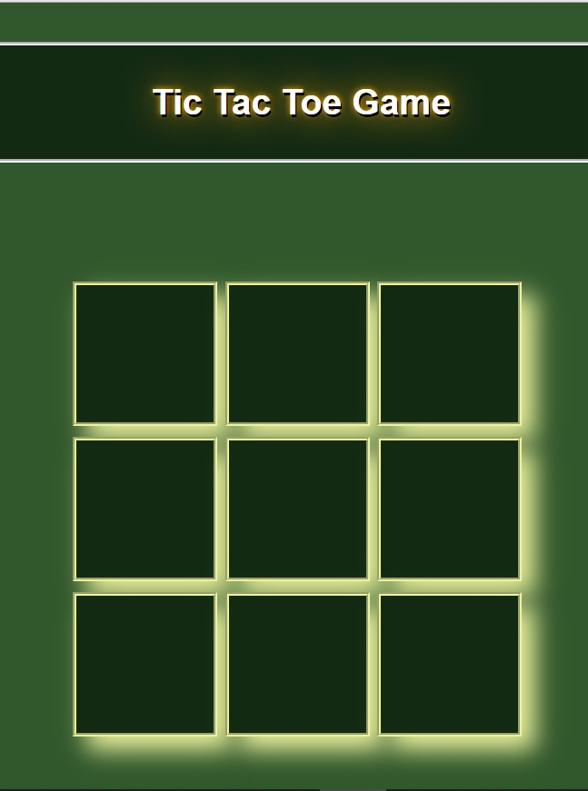

# Tic Tac Toe Game with React App
This is my first experience in developing applications with React. I used create-react-app to build this application.

## About Tic Tac Toe Game
Tic-tac-toe is a paper-and-pencil game for two players, X and O, who take turns marking the spaces in a 3×3 grid. The player who succeeds in placing three of their marks in a diagonal, horizontal, or vertical row is the winner. It is a solved game with a forced draw assuming best play from both players.
> get more information from: https://en.wikipedia.org/wiki/Tic-tac-toe

## About This App

